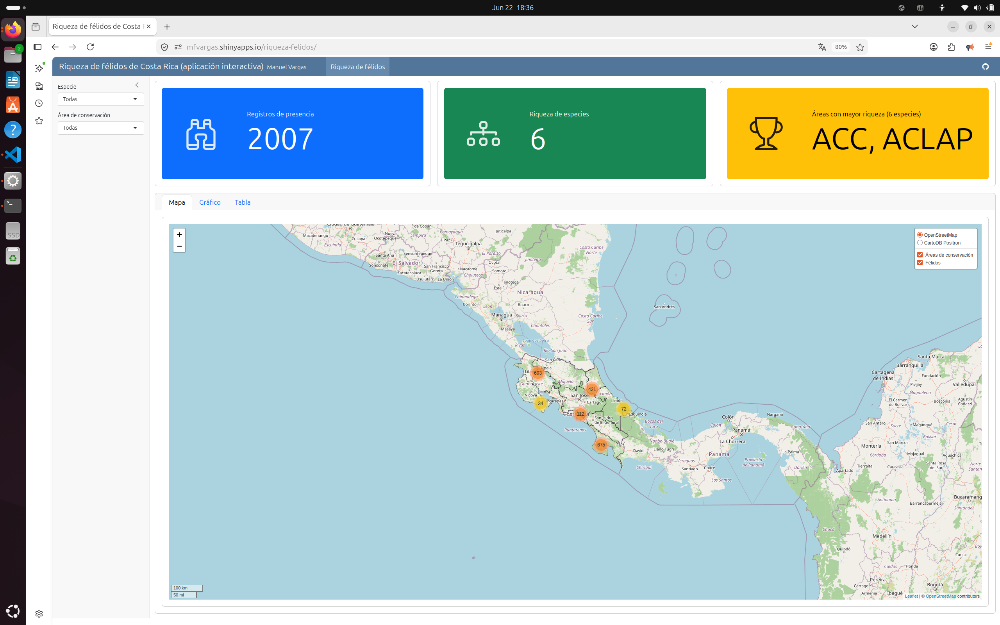

# Aplicación interactiva de riqueza de félidos de Costa Rica

[](https://mfvargas.shinyapps.io/riqueza-felidos/)

> 🔗 **[Ver la aplicación en vivo](https://mfvargas.shinyapps.io/riqueza-felidos/)**

Aplicación web interactiva desarrollada con [Shiny](https://shiny.posit.co/) y
[Quarto Dashboards](https://quarto.org/docs/dashboards/) que presenta la riqueza de
especies de félidos silvestres (familia *Felidae*) en Costa Rica, con base en
registros de presencia de [GBIF](https://www.gbif.org/) y los polígonos de las áreas
de conservación del [SINAC](https://www.sinac.go.cr/).

A diferencia del [tablero de control estático](https://github.com/gf0604-procesamientodatosgeograficos/2026-i-tablero-riqueza-felidos),
esta aplicación incorpora una **barra lateral** con dos filtros —especie y área de
conservación— y todas las salidas (tres cajas de valor, un mapa, un gráfico y una
tabla) se actualizan reactivamente en respuesta a esos filtros.

Es el ejemplo del capítulo *Shiny* del libro del curso
**GF-0604 Procesamiento de datos geográficos** (Escuela de Geografía, Universidad de Costa Rica).

## Aplicación publicada

<https://mfvargas.shinyapps.io/riqueza-felidos/>

## Desarrollo

```sh
# Ejecutar la aplicación localmente (servidor Shiny)
quarto preview index.qmd
```

En RStudio, abra `index.qmd` y presione **Run Document**.

Los datos se cargan en tiempo de ejecución desde el repositorio del curso
[`2026-i`](https://github.com/gf0604-procesamientodatosgeograficos/2026-i).

## Publicación en shinyapps.io

Una aplicación Shiny **no** puede publicarse como página estática en GitHub Pages,
porque necesita un servidor de R en ejecución. Se publica en
[shinyapps.io](https://www.shinyapps.io/) (cuenta `mfvargas`, app `riqueza-felidos`).

El despliegue es manual y requiere el *token* y el *secret* de la cuenta de shinyapps.io.
Pasos generales:

```r
# 1. Pre-renderizar la aplicación (shinyapps espera el HTML ya generado)
quarto::quarto_render("index.qmd")

# 2. Configurar la cuenta de shinyapps.io
rsconnect::setAccountInfo(name = "mfvargas", token = "<TOKEN>", secret = "<SECRET>")

# 3. Desplegar el directorio (HTML + index_files + index_data)
rsconnect::deployApp(
  appName     = "riqueza-felidos",
  forceUpdate = TRUE
)
```

> **Notas:**
> - Hay que instalar todas las dependencias del `.qmd` (incluido `bsicons`) en el
>   mismo entorno desde el que se despliega, para que entren en el *bundle*.
> - El plan gratuito de shinyapps.io permite un máximo de 5 aplicaciones.
